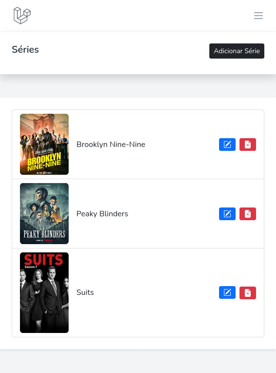
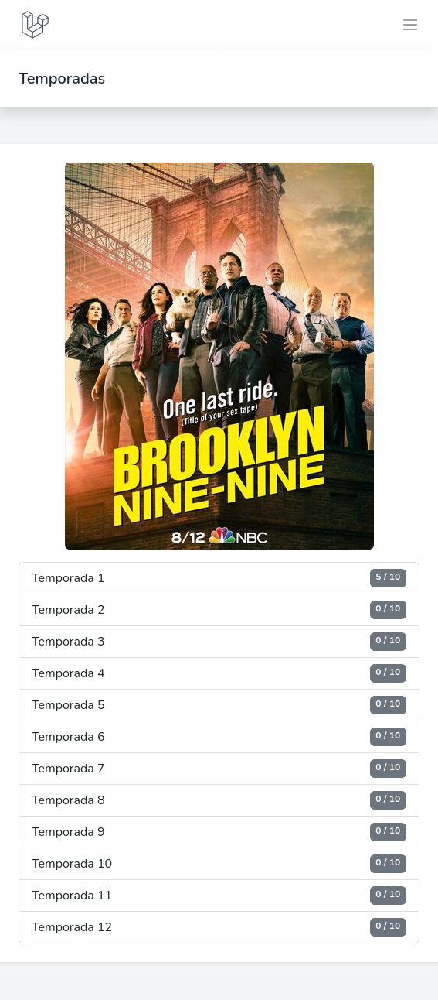

# Sistema administrador de Séries
Sistema administrador de séries que permite guardar séries favoritas, adicionar, editar e remover séries, além de salvar temporadas com número de episódios.
- Autenticação Breeze
- Envio de e-mails ao cadastrar séries
- Trabalhando com filas (conceito de Mensageria)
- Upload de arquivos
- Eventos
- Testes

